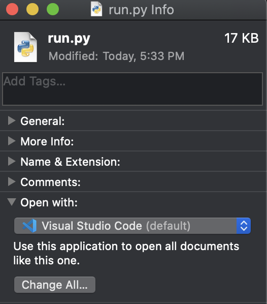

# Specify default application to open files based on filetype

1. Right click file with specified filetype
2. Select `Get Info`.
3. Select `Open with` in the new file window
4. Choose desired application.
5. Click `Change All`

